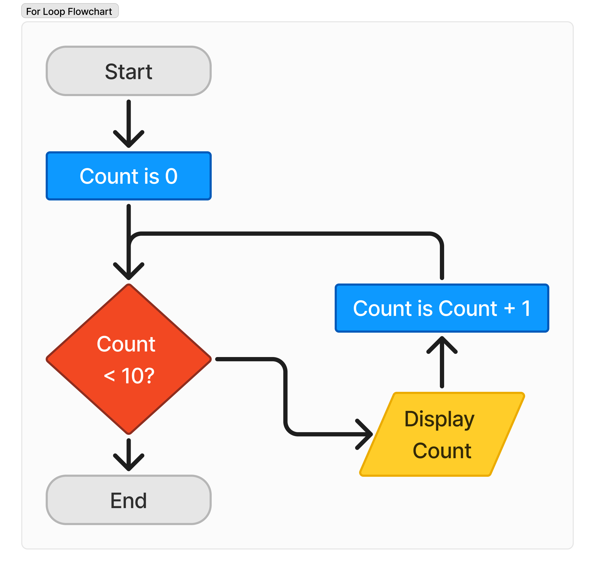

# For Loops

For loops are a way to "iterate" over a known range of values.

## Terms

| Term    | Meaning                                                    |
|---------|------------------------------------------------------------|
| Loop    | A method to repeat operation(s) multiple times             |
| Iterate | To perform an action repeatedly                            |
| Range   | The possible values used, with a minimum and maximum value |

## Pseudocode

```text
for count is from 0 to 9:
    display count
```

> **Note:**
> - 0 to 10 is a range of values


## Flowchart



## Code

```python
for count in range(10):
    print(count)
```


> **Note:**
> - the `range()` function always counts to one less than the maximum
> - `range()` has general structure `range(minimum, maximum, increment)`

### Output

```text
0
1
2
3
4
5
6
7
8
9
```

## Range Function

Examples of values generated by `range()`:

| Options                         | Example        | Values        |
|---------------------------------|----------------|---------------|
| `range(maximum)`                | range(5)       | 0, 1, 2, 3, 4 |
| `range(minimum, maximum)`       | range(1, 5)    | 1, 2, 3, 4    |
| `range(minimum, maximum, step)` | range(1, 5, 2) | 1, 3          |


## Example 1

This example goes from 1 to 9, in increments of 3.

As 7 + 3 is greater than 9, the loop stops after displaying 7.

### Pseudocode
```text
for count is from 1 to 10 step 3:
    display count
```

### Python
```python
for count in range(1, 10, 3):
    print(count)
```

### Output
```text
1
4
7
```
