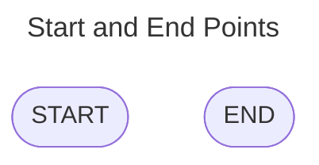
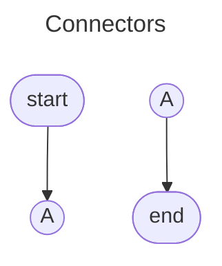
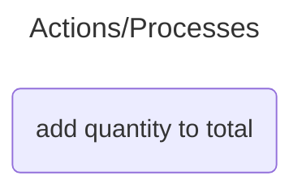
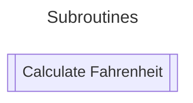
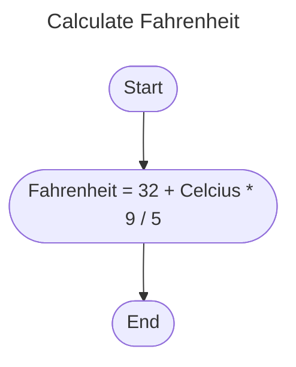
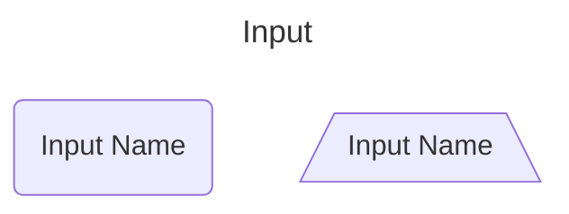
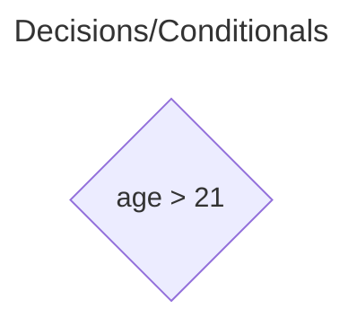
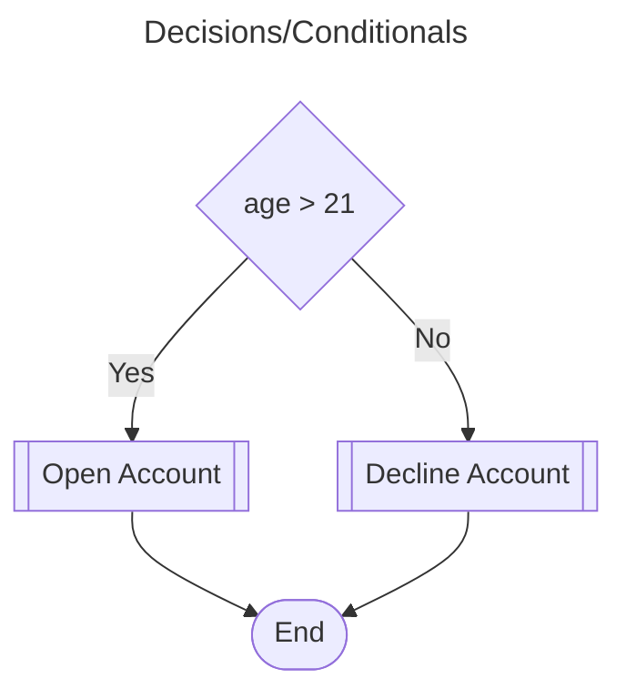
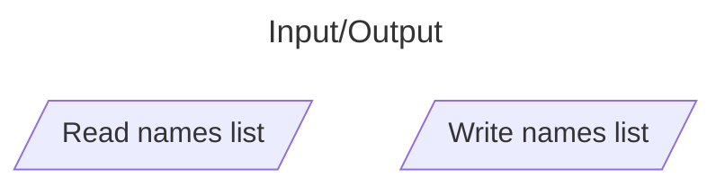
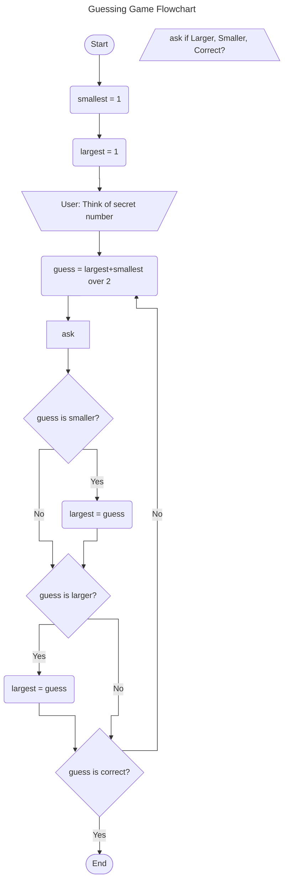

# Session 06 - Flowcharts

# Flowchart Symbols

> Note: Mermaid does not have all the symbols for traditional flowcharts, so you may need to 
> substitute to provide a meaningful experience.

### Start and End Points (Terminators)

### Connectors

Used to join up parts of a flowchart when the diagram cannot be placed on a single page, or 
would be too small if in a single line.

### Actions/Processes

Actions/Processes are any step that makes a change to data.

### Subroutine

When a sequence is too large to place into the main
diagram, we are able to separate it into a subroutine.

The subroutine is a rectangle with the ends having two lines.

When diagramming the subroutine, we simply create a new diagram
with a title that is the subroutine.

### User/Manual Input

This is the main symbol that Mermaid does not
support, and we can replace with a standard
process or us a symbol like a chopped off triangle.

### Conditionals

Decisions in flowcharts are represented by the diamond.

We combine this with yes and no branches...

### Data Input/Output

Usually used to represent data to and from files or similar.

## Guessing Game Flowchart

