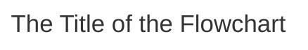
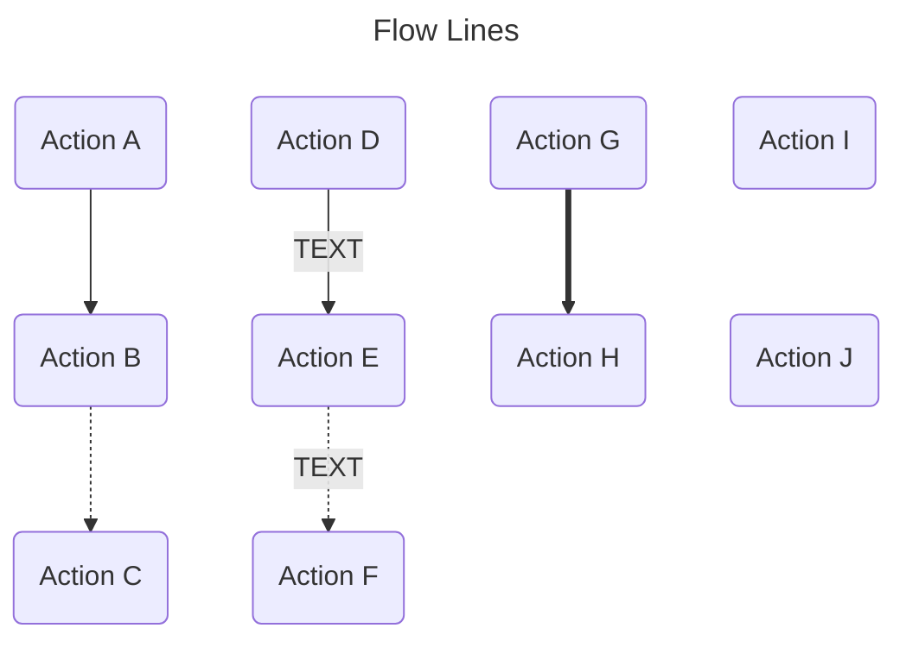
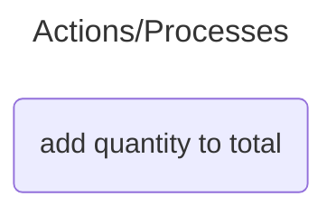
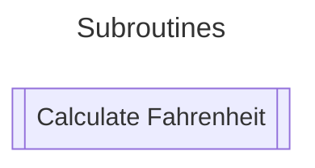
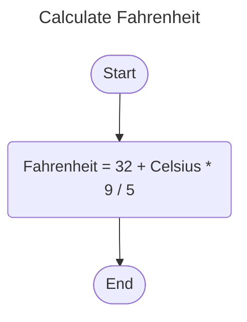
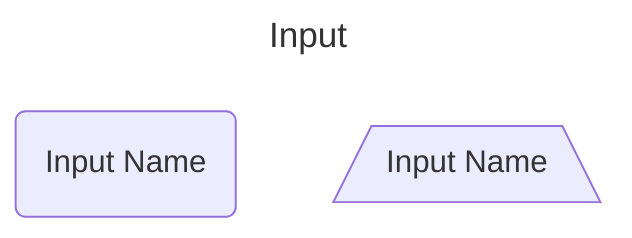
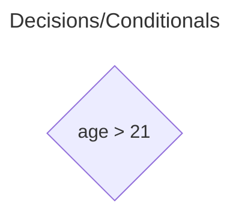
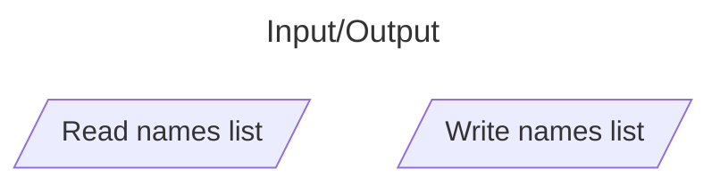
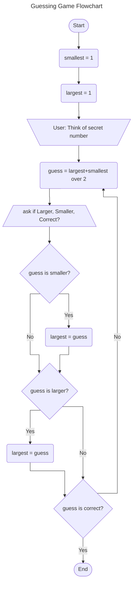

# Session 06 - Flowcharts

# Flowchart Symbols

The most common FlowChart symbols you will see are:

## Mermaid Flowcharts

Mermaid is a text base method of describing your flowcharts.

Below are the most common flowchart symbols in Mermaid syntax with their diagrams shown.

> **Note:**
>
> Mermaid does not have all the symbols for traditional flowcharts, so you may need to
> substitute to provide a meaningful experience.

### Mermaid Flowchart Markdown Wrapper

In Markdown, you add the following to tell a Mermaid enabled editor that we are writing a flowchart.

```text
    ```mermaid
    flowchart TD
    ```
```

All parts of the flowchart are then indented by FOUR (4) spaces at most from the start of the line.

#### What about TD?

There are two ways to draw a flowchart:

- Vertically
- Horizontally

These are designated by:

- `TD` = Top Down, and
- `LR` = Left to Right

### Optional Flowchart Title

You may then add an optional title to your flowchart. In some cases this may be essential. For example, see Subroutines.



This is achieved by adding the title separator (`---`), then `title:` and the title, followed by another separator (
`---`) before the `flowchart TD` or `flowchart LR` signifier.

```text
    ```mermaid
    ---
    title: The Title of the Flowchart
    ---
    flowchart TD    
    ```
```

### Symbols and Identifier Labels

When working with Mermaid, we generally create each symbol with an identifying label. This means we can create all the
chart symbols first, then describe how they fit together.

> **NOTE:**
>
> Some names may not be used, and one of them is `end`, so we fix this by adding a number such as `end1`.
>
> Also, every symbol needs to be named uniquely, just like variables and functions.

### Start and End Points (Terminators)


These are created using:

```text
start_id([START TEXT])

end_id([END TEXT])
```

### Flow Lines (or Joining Lines)

Flow Lines are the arrows that join the parts of the flowchart. There are a number of styles, but we generally use the
solid line version.

- Solid line `-->` (dash, dash, greater than)
- Dotted Line `-.->` (dash, dot, dash, greater than)
- Solid line with text `-- text -->`
- Dotted line with text `-. text .->`
- Thick line `==>` (equals, equals, greater than)
- Thick with text `== text ==>`
- Invisible link `~~~` (tilde, tilde, tilde)



There are other options, which you may read about
at [Mermaid: Links between Nodes - https://mermaid.js.org/syntax/flowchart.html#links-between-nodes](https://mermaid.js.org/syntax/flowchart.html#links-between-nodes).

### Connectors

Used to join up parts of a flowchart when the diagram cannot be placed on a single page, or
would be too small if in a single line.


The connector syntax is:

```text
connector_id((CONNECTOR TEXT))
```

### Actions/Processes

Actions/Processes are any step that makes a change to data.



The action symbol is represented by the following syntax:

```text
    action_id(ACTION TEXT)
```

### Subroutine

When a sequence is too large to place into the main
diagram, we are able to separate it into a subroutine.

The subroutine is a rectangle with the ends having two lines.

When diagramming the subroutine, we simply create a new diagram
with a title that is the subroutine.



The syntax for the subroutine is:

```text
    subroutine_id[[SUBROUTINE NAME/TEXT]]
```

Then to define the subroutine we use a new flowchart, with the `title` being required...

```text
    ---
    title: Subroutine name/text
    ---
    flowchart TD
        start_sub_id([Start])
        step1(The steps of the subroutine)
        step2(The steps of the subroutine)
        ...
        end_sub_id([End])
        
        start_sub_id-->step1
        step1-->step2
        step2-->...-->end_sub_id
```

Here is the example diagram for the Calculate Fahrenheit subroutine above:



### User/Manual Input

This is the main symbol that Mermaid does not support, and we can replace
with a standard process or use a symbol like a chopped off trapezoid (in Mermaid terms, this is a trapezoid).



### Conditionals

Decisions in flowcharts are represented by the diamond.



We combine this with yes and no branches...


### Data Input/Output

Usually used to represent data to and from files or similar.



### A Little Extra

We can have Mermaid format the lines with rectangular corners.
These are determined by adding a settings line to the code.

The settings line goes IMMEDIATELY BEFORE the `flowchart` line, and is in JSON format, with `%%` before and after to
signify the settings start and end.:

For example:

```text
%%{ init: { 'flowchart': { 'KEY': 'VALUE' } } }%%
```

This may be written over multiple lines if you wish.


```text
%%{ 
    init: { 
        'flowchart': { 
            'KEY': 'VALUE' 
        } 
    } 
}%%
```


#### Drawing Lines

Lines may be drawn curved, or in a "stepped" manner...

```text
%%{ init: { 'flowchart': { 'curve': 'CURVE_TYPE' } } }%%
```

The curve type is one of the following:

- `stepBefore`
- `stepAfter`
- `linear`
- `basis`
- `bumpX`
- `bumpY`
- `cardinal`
- `catmullRom`
- `monotoneX`
- `monotoneY`
- `natural`
- `step`


## Guessing Game Flowchart

The flowchart of our guessing game from the Pseudocode notes is shown below:

### The Code:

```text
    ```mermaid
    ---
    title: Guessing Game Flowchart
    ---
    %%{ init: { 'flowchart': { 'curve': 'stepAfter' } } }%%
    flowchart TD
        start([Start])
        smallest1(smallest = 1)
        largest1(largest = 1)
        secret[\User: Think of secret number/]
        guess1(guess = largest+smallest over 2)
        ask1[/ask if Larger, Smaller, Correct?\]
        if_smaller{guess is smaller?}
        smaller1(largest = guess)
        if_larger{guess is larger?}
        larger1(largest = guess)
        if_correct{guess is correct?}
        end1([End])
        start --> smallest1
        smallest1 --> largest1
        largest1 --> secret
        secret --> guess1
        guess1 --> ask1
        ask1 --> if_smaller
        if_smaller -->|Yes| smaller1
        if_smaller -->|No| if_larger
        smaller1 --> if_larger
        if_larger -->|Yes| larger1
        larger1 --> if_correct
        if_larger -->|No| if_correct
        if_correct -->|Yes| end1
        if_correct -->|No| guess1
    ```
```

### The Diagram:




# References

- https://boardmix.com/knowledge/flowchart-symbols-explained-from-basic-to-advanced/
- https://dev.to/angelotheman/from-logic-to-lines-unleashing-the-power-of-pseudocode-and-flow-charts-in-development-2615
- https://robertsj.github.io/me400_notes/lectures/Algorithms_Flowcharts_and_Pseudocode.html
- 